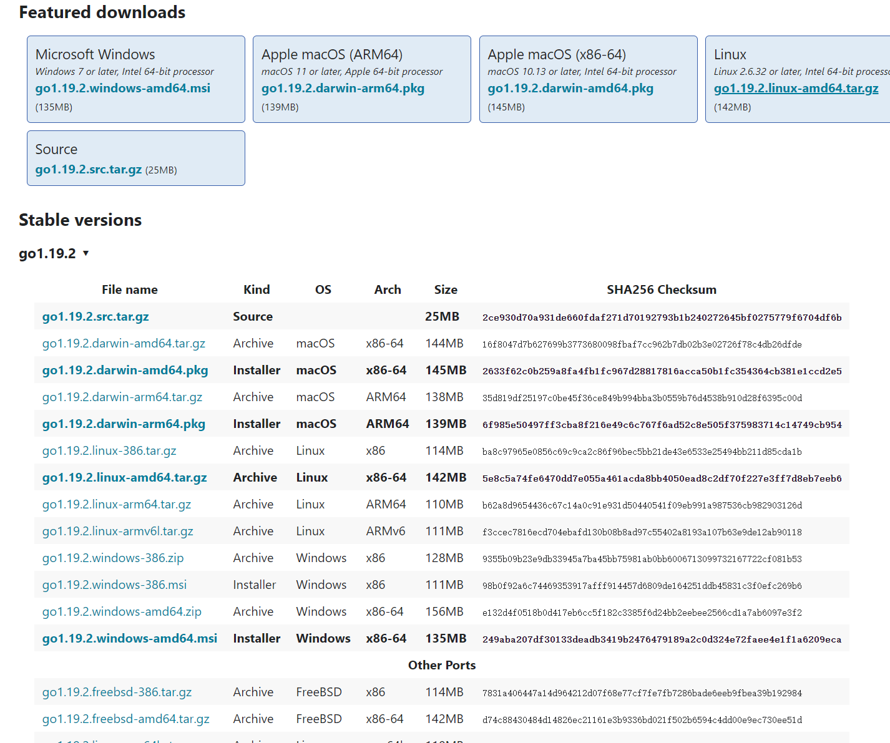
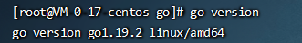

## **Go 语言支持以下系统：**

- Linux
- FreeBSD
- Mac OS X（也称为 Darwin）
- Windows

> 安装包下载地址为：https://golang.org/dl/
>
> 如果打不开可以使用这个地址：https://golang.google.cn/dl/。

根据自己的操作系统选择下载



## Windows安装


操作很简单，下载`.msi`文件，双击安装安装提示下一步即可

`GOPATH`是一个环境变量，用来表明你写的`go`项目的存放路径，也就是工作空间（`workspace`）

`GOPATH`路径最好只设置一个，所有的项目代码都放到`GOPATH`的`src`目录下。

Linux和Mac平台就参照上面配置环境变量的方式将自己的工作目录添加到环境变量中即可。 Windows平台将你的安装目录，例如：`D:\go`添加到环境变量，同时在`path`里面添加`go`的安装目录和`GOPATH`目录，在`GOPATH`新建三个文件夹，`src`、`pkg`、 `bin`

- `src `—- 里面每一个子目录，就是一个包。包内是Go的源码文件
- `pkg` —- 编译后生成的，包的目标文件
- `bin` —- 生成的可执行文件

## Linux下安装

下载对应系统的`tar.gz`文件


```shell
tar -zxvf go1.19.2.linux-amd64.tar.gz
```

##### 建立Go的工作空间（`workspace`，也就是GOPATH环境变量指向的目录）

GO代码必须在工作空间内。工作空间是一个目录，其中包含三个子目录：

- `src `—- 里面每一个子目录，就是一个包。包内是Go的源码文件
- `pkg` —- 编译后生成的，包的目标文件
- `bin` —- 生成的可执行文件

这里，我们在`/home`目录下, 建立一个名为go(可以不是go, 任意名字都可以)的文件夹，
然后再建立三个子文件夹(子文件夹名必须为src、pkg、bin)。

```shell
mkdir go_workspace
```

```shell
cd go_workspace
```

```shell
mkdir bin
```

```shell
mkdir src
```

```shell
mkdir pkg
```

##### 添加PATH环境变量and设置GOPATH环境变量

```shell
vi /etc/profile
```

```shell
export GOROOT=/usr/local/go        ##Golang安装目录
export PATH=$GOROOT/bin:$PATH
export GOPATH=/home/go  ##Golang项目目录
```

然后刷新环境变量

```shell
source /etc/profile
```

查看版本号是否安装成功，能输出版本号就是成功了

```shell
go version
```



