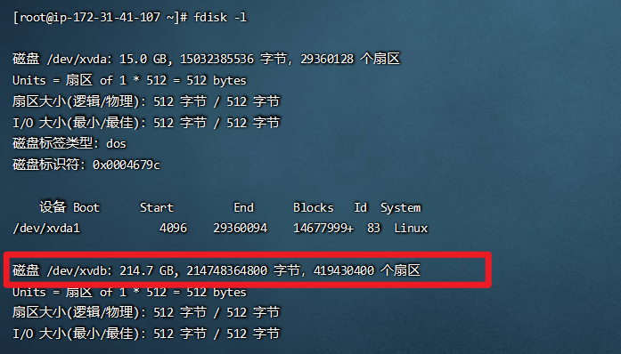

# centos7 挂载硬盘

1、查看当前未挂载的硬盘

```shell
fdisk -l
```


  2、创建硬盘分区

```shell
fdisk /dev/xvdb
```

  根据提示，依次输入"n"，"p" "1"，两次回车，"wq"，分区就开始了，很快就会完成。


  3、格式化硬盘

```shell
mkfs.ext4 /dev/xvdb
```


  4、建立挂载目录

```shell
mkdir /data
```


  5、挂载硬盘

```shell
mount /dev/xvdb /data
```


  6、设置开机自动挂载

```shell
vi /etc/fstab
```


  7、在vi中输入i进入INERT模式，将光标移至文件结尾处并回车，将下面的内容复制/粘贴，然后按Esc键，输入":wq"(不含双引号)保存并退出

```shell
/dev/xvdb    /data    ext4    defaults    0 0
```


  8、重启服务器

```shell
shutdown -r now
```

 

**如果遇到写保护，将以只读方式挂载。mount: 未知的文件系统类型“(null)”，请按下面的方法来处理**

```shell
mount /dev/xvdb /mnt/usb/
```

> mount: /dev/sdb 写保护，将以只读方式挂载
> mount: 未知的文件系统类型“(null)”

格式化一下

```shell
mkfs.ext4 /dev/xvdb
```

> mke2fs 1.42.9 (28-Dec-2013)
> /dev/sdb is entire device, not just one partition!
> 无论如何也要继续? (y,n) y
> 文件系统标签=
> OS type: Linux
> 块大小=4096 (log=2)
> 分块大小=4096 (log=2)
> Stride=0 blocks, Stripe width=0 blocks
> 476720 inodes, 1904000 blocks
> 95200 blocks (5.00%) reserved for the super user
> 第一个数据块=0
> Maximum filesystem blocks=1950351360
> 59 block groups
> 32768 blocks per group, 32768 fragments per group
> 8080 inodes per group
> Superblock backups stored on blocks: 
>     32768, 98304, 163840, 229376, 294912, 819200, 884736, 1605632
>
> Allocating group tables: 完成                            
> 正在写入inode表: 完成                            
> Creating journal (32768 blocks): 完成
> Writing superblocks and filesystem accounting information: 完成 

再进行挂载

```
mount /dev/xvdb /mnt/usb/
```

 